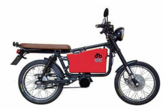
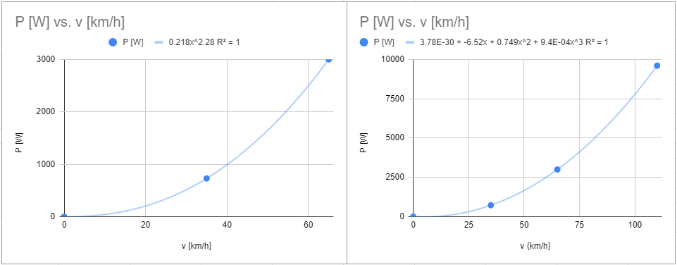
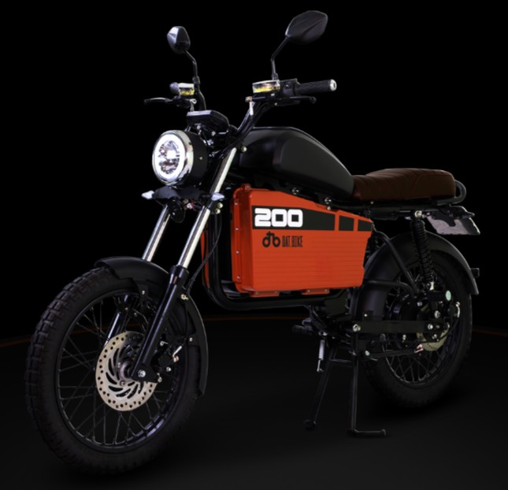

# dat.bike

This repository is used to collect and document parts of the development of this Vietnamese electric motorcycle startup.

## Version 1

After some prototyping in California during 2018 this bike was produced eventually in Vietnam and a dozen was rented out and sold. The rental shop opened at the beginning of 2019 in [Da Nang](https://youtu.be/OHJpOSwf7EA) at [23 Nguyễn Thái Học](https://goo.gl/maps/p3gNxgxKgGf4U6ET7). 

The 1.5 kW motor was mounted on the bottom of the frame and connected to the rear wheel with a chain. That changed at the end of 2019.

## Version 2 - November 2019

As an upgrade the motor moved to the rear axis and the main operation moved to Ho Chi Minh City and Bing Duong. Peak power is now 5 kW.

You can have a look at the battery, and how the power would probably distribute:

 

April 2021 dat.bike received a [pre-Series A funding](https://techcrunch.com/2021/04/12/vietnamese-electric-motorbike-startup-dat-bike-raises-2-6m-led-by-jungle-ventures/) led by Jungle Ventures of $2.6 million.

## Version 2.1 (Weaver 200) - November 2021

The battery is more than twice as large, the front fender longer, the feet rest for the pillion mounted to the frame (finally!) and the motor power is increased to 6 kW.

Since November 2020 I am working on a [document about dat.bike](Dat Bike information.pdf) - now with v0.8 some 60 pages long.