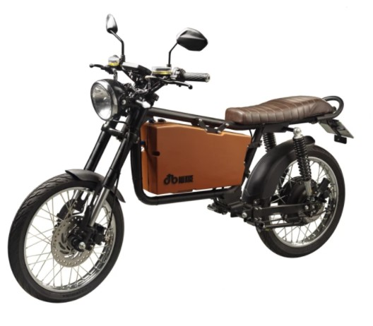

# dat.bike version 3

Not really a secret. The design choices for v2 (some are inherited from v1) simply cannot be fixed. We need to design a new bike from ground up:

- New Frame. It adresses several issues
  - Split frame. Head position and angle and relative rear wing are relocated
  - Seat can be modified for different application or seat height or design
  - Place for larger battery and lower center of mass
  - Single suspension spring. Mainly for optics
  
- New Battery
  - The capacity of 2088 Wh of the old one is not large enough
  - The old one cannot be removed
  - The connectors are on weired locations
  - Not even a circuit breaker is present as safety measure!
  
That's not how it looks:

